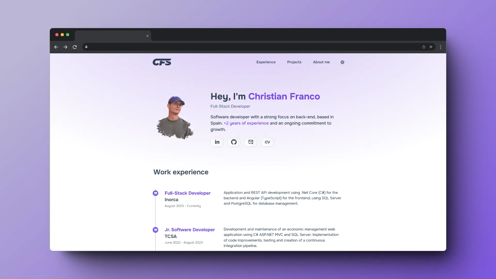

<div align="center">
    <a href="https://christianfranco.dev">
        
    </a>
</div>

<div align="center">
    <a href="https://christianfranco.dev" target="_blank">
        Website
    </a>
    <span>&nbsp;-&nbsp;</span>
    <a href="https://github.com/pheralb/pheralb.dev?tab=readme-ov-file#-contributing">
        LinkedIn
    </a>
    <span>&nbsp;-&nbsp;</span>
    <a href="https://github.com/c-franco/christianfranco.dev?tab=readme-ov-file#stack">
        Stack
    </a>
    <span>&nbsp;-&nbsp;</span>
    <a href="https://github.com/c-franco/christianfranco.dev?tab=readme-ov-file#getting-started">
        Getting Started
    </a>

</div>

## 📦 Stack

- [**HTML5**](https://developer.mozilla.org/es/docs/Web/HTML) - Structuring web content.
- [**CSS3**](https://developer.mozilla.org/es/docs/Web/CSS) - Styling and layout design.
- [**JavaScript**](https://developer.mozilla.org/es/docs/Web/JavaScript) - Interactive and dynamic elements.
- [**Icons8**](https://icons8.com/) + [**svgl**](https://svgl.app/) - Beautiful SVGs icons & logos.
- [**Vercel**](https://vercel.com) - Deployment and hosting.
- [**Visual Studio Code**](https://code.visualstudio.com/) - Code editing and development.

## Getting Started

Follow the steps below to set up and run the project on your local machine.
Prerequisites

Before you begin, ensure you have the following installed on your system:

```bash
Node.js (version 14.x or later)
npm (Node Package Manager)
```

1 - Clone the repository:

```bash
git clone https://github.com/c-franco/christianfranco.dev.git

cd christianfranco.dev
```

2 - Install dependencies

```bash
npm install
```

3 - Install [Live Server](https://marketplace.visualstudio.com/items?itemName=ritwickdey.LiveServer) extension.

4 - Press 'Go Live' button, open your preferred web browser and navigate to http://localhost:5500 to view the portfolio.

## 📜 License

This web is released under the [MIT License](LICENSE).
